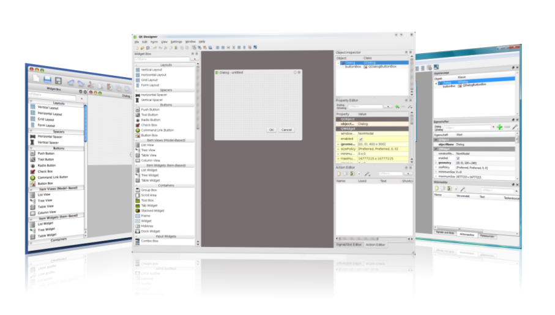
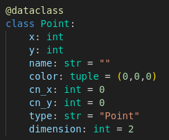
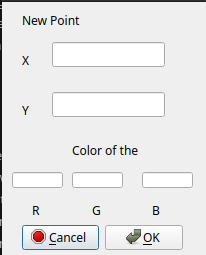
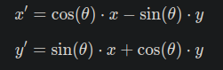

# INE5420 - Computação Gráfica - 2024/2

## Sistema Gráfico Interativo

### Introdução

Consiste numa interface gráfica em que o usuário pode carregar arquivos.obj e/ou criar seus próprios elementos (pontos, linhas, polígonos) e manipulá-los de várias formas.

Essa documentação trará uma breve explicação de alguns dos principais elementos que orientaram a implementação desse sistema, assim como as ferramentas utilizadas. Por fim, uma explicação de como testar a aplicação e uma seção de dificuldades enfrentadas.

### Desenvolvimento

Esse SGI foi feito utilizando principalmente a biblioteca [PyQt5](https://pypi.org/project/PyQt5/), que fornece uma interface para o [Qt5](https://www.qt.io/), que por sua vez é uma biblioteca para criação de interfaces gráficas de usuário. 

O PyQt5 funciona por meio de Orientação Objetos utilizando sinais e slots, ou seja, implementando botões na GUI, por exemplo, gera um sinal que pode ser direcionado para uma função, que realiza um cálculo ou imprime um objeto na tela.

Para fazer a interface gráfica mais facilmente, há uma ferramenta chamada [Qt Designer](https://doc.qt.io/qt-6/qtdesigner-manual.html), a qual pode ser observada na figura a seguir. Essa ferramenta permite criar layouts de GUI de forma gráfica e importar o .ui para o sistema. Dessa forma foi possível integrá-los ao código em python sem precisar implementar cada pequeno detalhe da interface gráfica, apenas manipulando os sinais com suas respectivas funções.

Na pasta "qt_design" tem todos os arquivos .ui que foram criados utilizando o Qt Designer, cada um deles representa uma interface do SGI.

O SGI foi implementado em etapas, seguindo as entregas da disciplina. Dessa forma, as seguintes funções foram implementadas:

1. Adicionar pontos, linhas e polígonos, assim como a capacidade de dar zoom e navegar pela window;
2. 

#### 1. Adicionando objetos e funções básicas de navegação

Para a adição de objetos 2D básicos, foi modelado dataclasses, as quais contém informações sobre os objetos, como nome, suas componenetes, cor, tipo, etc. 

Para a adição desses objetos, botões correspondentes aparecem na SGI, os quais tem campos de entrada para as coordenadas dos pontos/componentes e cor do objeto.

As funções de navegação "Zoom In", "Zoom Out" e mover a tela para alguma das quatro direções (esquerda, direita, baixo e cima) funcionam manipulando as coordenadas da window, X e Y máximos e mínimos. No caso das navegações, a fórmula de rotação é utilizada utilizando um vetor base que indica para qual direção a tela irá se mover. 

