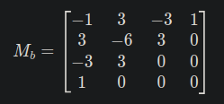

# INE5420 - Computação Gráfica - 2024/2

## Sistema Gráfico Interativo

### Introdução

Consiste numa interface gráfica em que o usuário pode carregar arquivos.obj e/ou criar seus próprios elementos (pontos, linhas, polígonos) e manipulá-los de várias formas.

Essa documentação trará uma breve explicação de alguns dos principais elementos que orientaram a implementação desse sistema, assim como as ferramentas utilizadas. Por fim, uma explicação de como testar a aplicação e uma seção de dificuldades enfrentadas.

### Desenvolvimento

Esse SGI foi feito utilizando principalmente a biblioteca [PyQt5](https://pypi.org/project/PyQt5/), que fornece uma interface para o [Qt5](https://www.qt.io/), que por sua vez é uma biblioteca para criação de interfaces gráficas de usuário. 

O PyQt5 funciona por meio de Orientação Objetos utilizando sinais e slots, ou seja, implementando botões na GUI, por exemplo, gera um sinal que pode ser direcionado para uma função, que realiza um cálculo ou imprime um objeto na tela.

Para fazer a interface gráfica mais facilmente, há uma ferramenta chamada [Qt Designer](https://doc.qt.io/qt-6/qtdesigner-manual.html), a qual pode ser observada na figura a seguir. Essa ferramenta permite criar layouts de GUI de forma gráfica e importar o .ui para o sistema. Dessa forma foi possível integrá-los ao código em python sem precisar implementar cada pequeno detalhe da interface gráfica, apenas manipulando os sinais com suas respectivas funções.


Na pasta "qt_design" tem todos os arquivos .ui que foram criados utilizando o Qt Designer, cada um deles representa uma interface do SGI.

O SGI foi implementado em etapas, seguindo as entregas da disciplina. Dessa forma, as seguintes funções foram implementadas:

1. Adicionar pontos, linhas e polígonos, assim como a capacidade de dar zoom e navegar pela window;
2. Transformações 2D, como rotações, translações e escalonamentos;
3. Clipping dos objetos, Cohen-Sutherland e Liang-Barsky;
4. Curvas 2D, Bezier e B-Spline;
5. Objetos 3D e projeções da window;
6. Superfícies Bicúbicas;
7. Manipulação de arquivos .obj.

#### 1. Adicionando objetos e funções básicas de navegação

Para a adição de objetos 2D básicos, foi modelado dataclasses, as quais contém informações sobre os objetos, como nome, suas componenetes, cor, tipo, etc. 


Para a adição desses objetos, botões correspondentes aparecem na SGI, os quais tem campos de entrada para as coordenadas dos pontos/componentes e cor do objeto.


As funções de navegação "Zoom In", "Zoom Out" e mover a tela para alguma das quatro direções (esquerda, direita, baixo e cima) funcionam manipulando as coordenadas da window, X e Y máximos e mínimos. No caso das navegações, a fórmula de rotação é utilizada utilizando um vetor base que indica para qual direção a tela irá se mover. 


#### 2. Transformações 2D

As funções de transformação de objetos e da window foram implementadas considerando o conceito de coordenadas homogêneas, utilizando as multiplicações de matrizes para realizar essas operações. 

De acordo com o tipo de objeto, suas coordenadas são mapeadas para uma matriz e as transformações são aplicadas. Cada uma pede coordenadas de base para orientar a transformação. No caso da rotação da window, é recebido as coordenadas da rotação e em seguida manipulado o ângulo da window, variável que orienta o ângulo de todos os objetos da window e permite que todos os objetos dentro da window sofram a rotação esperada.


### 3. Clipping dos objetos

Clipping consiste na capacidade de recortar objetos da da window, para garantir que apenas os objetos relevantes sejam desenhados. Para realizar o clipping, uma "moldura" em vermelho foi adicionada à window, a qual permite ver quais objetos estão "dentro" e quais objetos não estão sendo desenhados por estarem "fora". 


Isso é feito determinando-se quais coordenadas estão dentro da window e quais não estão. Isso é atualizado toda vez que uma transformação acontece. Além disso, dois algoritmos foram utilizados para realizar o clipping de linhas: Clipping de Cohen-Sutherland e Clipping de Liang-Barsky. Pelo primeiro foi criado uma versão simplificada de regiões para determinar os pontos dentro. Já o segundo faz uma melhoria do primeiro pelo cálculo das intersecções das linhas com as bordas da window. 

### 4. Curvas 2D

As curvas 2D implementadas nesse sistema são as curvas paramétricas de Bezier e as B-Splines. A primeira é definida com um conjunto de pontos de controle que determinarão o formato da curva, em que continuidade da mesma representa a "suavidade" da curva ou à ausência de descontinuidades da mesma. Já uma B-spline é uma curva ou superfície que é composta por segmentos de curvas polinomiais que se unem de forma suave. 

Elas foram implementadas de forma a receber do usuário a lista de pontos das curvas e a precisão, que representa a densidade da curva. Um valor menor de precisão resulta em uma curva mais detalhada (mais pontos gerados) e mais iterações são feitas pelo algoritmo. 

A curva de Bezier foi implementada considerando a interpolação e o número de pontos a ser utilizado como controle serão usados para gerar os outros. Através do método de blending, que gera os coeficientes de interpolação, a interpolação é feita e os produtos escalares dos pontos de controle são utilizados para gerar os novos pontos. 

Para a B-Spline, para cada ponto de controle é criado um subgrupo de pontos, a borda superior e os deltas (variação) dos pontos são calculados. As coordenadas são ajustadas com base nos cálculos dos deltas, os quais são progressivamente incrementados. 

Outro adição a esse SGI, é as Forward Differences, que consiste em calcular calcular sucessivas diferenças entre valores de uma sequência ou função discreta. Aplicando-se essa técnica em B-Splines, primeiro determina-se os incrementos iniciais, os deltas, depois calcula-se sucessivamente os próximos pontos das curvas.


### 5. Objetos 3D e Projeções da Window

É possível adicionar objetos 3D, nesse caso, com a adição de um ponto Z às coordenadas e as coordenadas das arestas do mesmo. Dessa forma, o objeto tem profundidade no espaço da window, a qual pode ser observada pela projeção em perspectiva. Para a visualização da tridimensionalidade, foram utilizadas matrizes de pontos, as quais são manipuladas para a realização das transformações. 


Para a realização dessas e de outras operações, as matrizes de transformação e projeção (PPC) são utilizadas. Elas funcionam seguindo os seguintes passos:

a. Normalização dos limites da window;
b. Cálculo das dimensões da window;
c. Definição das matrizes de transformação para cada uma das transformações: rotação, translação e escalonamento;
d. Composição das mesmas em uma matriz PPC.

Essa operação é aplicada a vários objetos gráficos, de forma a calcular as coordenadas normalizadas, a exemplo da projeção em perspectiva. Essa operação é chamada todas as vezes que qualquer função, seja adição ou transformação de um objeto, é realizada no SGI. A matriz PPC garante que cada ponto 3D seja mapeado corretamente para a área de exibição, respeitando as proporções e a perspectiva desejada.

As transformações de objetos 3D são bem semelhantes às transformações 2D, com a diferença de que consideram mais uma dimensão para a transformação, aplicando uma correção do deslocamento do objeto em relação à origem do mesmo, feita por uma translação ao final do escalonamento e da rotação.

### 6. Superfícies Bicúbicas

As superfícies bicúbicas de bezier são utilizadas para representar superfícies tridimensionais suaves. Enquanto uma curva de Bézier é definida por pontos de controle ao longo de uma dimensão, as superfícies bicúbicas são definidas em duas dimensões, utilizando uma malha bidimensional de pontos de controle. 

Nesse SGI há duas formas de criar essas superfícies, a primeira utilizando o método citado anteriormente e a segunda através de Forward Differences. Na primeira, o usuário deve fornecer 16 pontos de controle, os quais são organizados em três matrizes, representando as coordenadas x, y, e z da grade de controle 4x4. A seguinte matriz então é utilizada:



Essa matriz define como os pontos de controle afetam os pontos na superfície. Para cada s e t (parâmetros da superfície) entre 0 e 1, calcula-se:


As arestas são criadas conectando pontos consecutivos, e o objeto 3D resultante é armazenado e exibido.

O método utilizando Forward Differences lê da entrada do usuário o número de linhas de pontos de controle e organiza esses pontos em matrizes, representando as coordenadas. Calcula-se, então, as matrizes de coeficientes e as de Forward Differences para controlar os incrementos de s e t. Calcula-se os incrementos pela multiplicação de ambas as matrizes. Por fim, os pontos da curva ou superfície são gerados iterativamente, somando as diferenças calculadas.


### 7. Manipulação de arquivos .obj

Esse SGI permite a importação e visualização de arquivos .obj, os quais armazenam objetos gráficos 2D e 3D diversos, como pontos, linhas e polígonos. Ainda, permitem a adição de características, como nomes e cores. Os métodos desse SGI mapeiam as informações contidas nesse arquivo para o padrão suportado pelo sistema, transformando os mesmos em objetos correspondentes atráves das dataclasses que definem cada tipo de objeto. Esse sistema conta com um arquivo de teste contendo um ponto, um cubo e uma reta.


## Como testar

Para testar a aplicação deve-se clonar este repositório através do seguinte comando:

```
git clone https://github.com/Brenda-Machado/computacao-grafica.git
```

Em seguida, entre no diretório da aplicação:

```
cd sistema-grafico-interativo
```

Nesse diretório é onde está contido o source code da aplicação, assim como esse README.md e um Makefile para rodar a mesma. Para testar o SGI, rode o seguinte comando:

```
make run
```

Esse comando baixará as dependências desse SGI, assim como iniciará um ambiente virtual para rodar a aplicação. Após isso, ele iniciará o programa. Você deverá ver a interface gráfica após os downloads. Caso não veja, verifique as versões das bibliotecas utilizada, caso seja necessário, dê um downgrade especificando a versão que deseja no requirements.txt e rode novamente o comando acima.

Pronto! Pode adicionar objetos e realizar transformações à vontade.

## Problemas enfrentados e conclusão

Para a realização desse projeto, muitas dificuldades foram enfrentadas, principalmente devido ao tempo. Realizando o trabalho de forma solo (sem uma dupla), foi difícil entregar todos os requisitos das entregas a tempo e de forma eficiente. Dessa forma, há vários problemas estruturais no código, não há modularidade e a Orientação Objetos muitas vezes não é respeitada. Foi uma forma de entregar o código funcionando de forma rápida, mas para um projeto real seria bem ineficiente. 

Outro problema enfrentado foi justamente a eficiência do código, principalmente em relação à representação gráfica das curvas. Para valores de precisão muito baixos (perto de 0), a aplicação não consegue rodar, ocupando muita memória RAM e consequentemente o SO faz um kill no processo, fechando o SGI. Assim, para testes, deve-se usar sempre que possível precisão igual a 1, o que prejudica o formato da curva, deixando ela menos sinuosa. 

## Referências

+ Computer Graphics - Principles and Practice 2ed in C - James D. Foley et.al.
+ Wangenheim, Aldo V. Computação Gráfica: slides, videoaulas e links. 2024.
+ PYQT5, M. F. L. UPDATED G. STARTED WITH. Create your first Python GUI with PyQt5 — A simple Hello world app. Disponível em: <https://www.pythonguis.com/tutorials/creating-your-first-pyqt-window/>.
+ IT TRAINING. Building Powerful GUIs with PyQt: Comprehensive Tutorial and Best Practices. Disponível em: <https://medium.com/@jtpoint22/building-powerful-guis-with-pyqt-comprehensive-tutorial-and-best-practices-6249b3a4ee50>.
+ IJAZ, H. Loading 3D Shapes from OBJ Files in Python: A Guide to the load_shape_from_obj Method. Disponível em: <https://medium.com/@harunijaz/the-code-above-is-a-python-function-that-reads-and-loads-data-from-a-obj-e6f6e5c3dfb9>. 
+ An In-Depth Look at Bicubic Bezier Surfaces. Disponível em: <https://www.gamedeveloper.com/programming/an-in-depth-look-at-bicubic-bezier-surfaces>.
+ JASON. 3D Affine Transformation Matrices Implementation with NumPy. Disponível em: <https://python.plainenglish.io/3d-affine-transformation-matrices-implementation-with-numpy-57f92058403c>.
+ Capítulo 3 Transformacões geométricas | Material introdutório de Processamento Digital de Imagens e Visão Computacional. Disponível em: <https://covap-utfpr.github.io/pdi/transformacoesGeometricas.html>.

‌

‌

‌

‌

‌
‌
